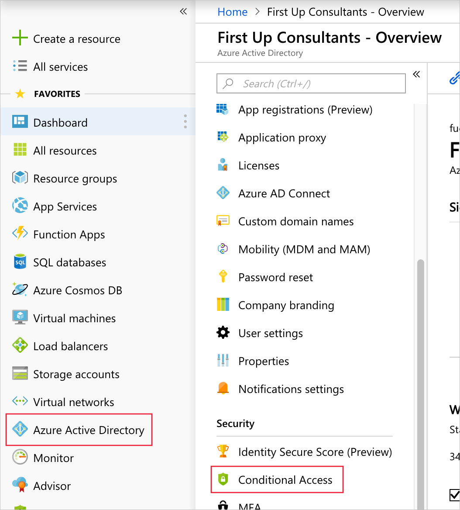
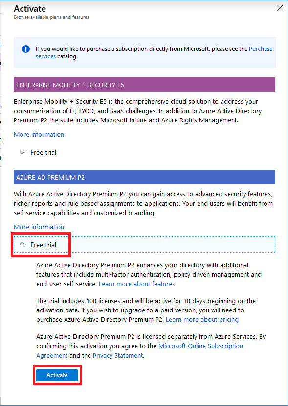

# Exercise - Secure access to resources

* 3 minutes

In the previous exercise, we enabled trial licenses, created a directory, created a user, and created a group to test our solution. In this unit, we will create our conditional access rule to require Azure Multi-Factor Authentication for the Azure portal.

## Login to the Azure Portal

1. Open the [Azure portal](https://portal.azure.com) in a browser.

2. Sign into Azure using the Microsoft account email address and password you created for this session.

## Enable conditional access-based Multi-Factor Authentication

Conditional access allows administrators to configure when they do or do not want something to happen. They can use multiple rules in parallel to grant or deny access to resources. Here's the rule that we need to create:

### When accessing the Azure portal - Require multi-factor authentication

The steps that follow will walk you through the process to create a conditional access rule to require users to perform multi-factor authentication when they access the Azure portal.

1. Browse to **Azure Active Directory**, and in the resulting blade locate and select **Conditional access** in the **Security** subsection.

    

2. Click **Baseline policy: Require MFA for Service Management (Preview)**. This will open a new blade for configuring the policy.

3. Click to select **Enable policy** and then click **Save**.

    

In this unit, you learned how to enable a conditional access baseline policy. The rule requires Multi-Factor Authentication when accessing the Azure Resource Manager APIs.
