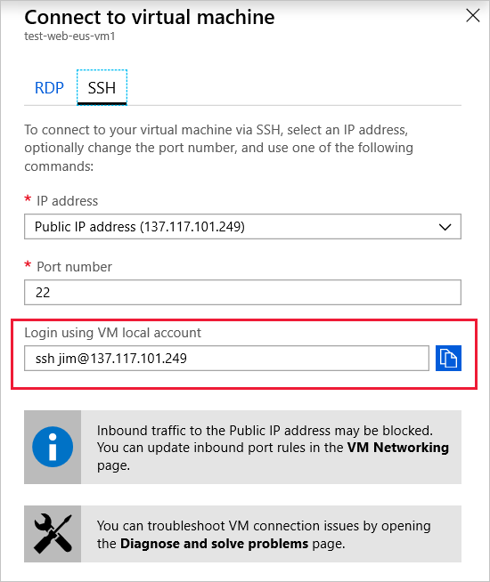

# Exercise - Connect to a Linux virtual machine with SSH

* 15 minutes

Let's connect to our Linux VM with SSH, and configure Apache, so we have a running web server.

## Login to the Azure Portal

1. Open the [Azure portal](https://portal.azure.com) in a browser.

2. Sign into Azure using the Microsoft account email address and password you created for this session.

## Get the public IP address of the VM

1. In the Azure portal, ensure the **Overview** panel for the virtual machine that you created earlier is open. You can find the VM under **All Resources** if you need to open it. The overview panel allows you to

    * See if the VM is running
    * Stop or restart the VM
    * Get the public IP address of the VM
    * See the activity of the CPU, disk, and network
2. Click the **Connect** button at the top of the pane.

3. In the **Connect to virtual machine** panel, note the **IP address** and **Port number** settings. On the **SSH** tab, you will also find the command you need to execute locally to connect to the VM. Copy the command to the clipboard.

    

## Connect with SSH

1. Paste the command from your clipboard into the Azure Cloud Shell. It should look something like the sample below; however, it will have a different IP address (and perhaps a different username if you didn't use **jim**!):

    ```
    ssh jim@137.117.101.249
    ```

    The first time we connect, SSH will ask us about authenticating against an unknown host. SSH is telling you that you've never connected to this server before. If that's true, then it's perfectly normal, and you can respond with **yes** to save the fingerprint of the server in the known host file:

    ```
    The authenticity of host '137.117.101.249 (137.117.101.249)' can't be established.
    ECDSA key fingerprint is SHA256:w1h08h4ie1iMq7ibIVSQM/PhcXFV7O7EEhjEqhPYMWY.
    Are you sure you want to continue connecting (yes/no)? yes
    Warning: Permanently added '137.117.101.249' (ECDSA) to the list of known hosts.
    ```

2. This command will open an SSH connection and place you at a shell command prompt for Linux.

3. Try executing a few Linux commands

    * `ls -la /` to show the root of the disk
    * `ps -l` to show all the running processes
    * `dmesg` to list all the kernel messages
    * `lsblk` to list all the block devices - here you will see your drives

## Install software onto the VM

As you can see, SSH allows you to work with the Linux VM just like a local computer. You can administer this VM as you would any other Linux computer: installing software, configuring roles, adjusting features, and other everyday tasks. Let's focus on installing software for a moment.

You can also install software from the internet when you are connected to the VM via SSH. Azure machines are, by default, internet connected. You can use standard commands to install popular software packages directly from standard repositories. Let's use this approach to install Apache.

### Install the Apache web server

Apache is available within Ubuntu's default software repositories, so we will install it using conventional package management tools:

1. Start by updating the local package index to reflect the latest upstream changes:

    ```
    sudo apt-get update
    ```

2. Next, install Apache:

    ```
    sudo apt-get install apache2 -y
    ```

3. It should start automatically - we can check the status using `systemctl`:

    ```
    sudo systemctl status apache2 --no-pager
    ```

    The `systemctl` command returns something like:
    ```
        apache2.service - The Apache HTTP Server
           Loaded: loaded (/lib/systemd/system/apache2.service; enabled; vendor preset: enabled)
          Drop-In: /lib/systemd/system/apache2.service.d
                   └─apache2-systemd.conf
           Active: active (running) since Mon 2018-09-03 21:00:03 UTC; 1min 34s ago
         Main PID: 11156 (apache2)
            Tasks: 55 (limit: 4915)
           CGroup: /system.slice/apache2.service
                   ├─11156 /usr/sbin/apache2 -k start
                   ├─11158 /usr/sbin/apache2 -k start
                   └─11159 /usr/sbin/apache2 -k start

        test-web-eus-vm1 systemd[1]: Starting The Apache HTTP Server...
        test-web-eus-vm1 apachectl[11129]: AH00558: apache2: Could not reliably determine the server's fully qua
        test-web-eus-vm1 systemd[1]: Started The Apache HTTP Server.
    ```

    **Note**

    It's trivial to execute commands like this, however it's a manual process - if we always need to install some software, you might consider automating the process using scripting.

4. Finally, we can try retrieving the default page through the public IP address. However, even though the web server is running on the VM, you won't get a valid connection or response. Do you know why?

We need to perform one more step to be able to interact with the web server. Our virtual network is blocking the inbound request. We can change that through configuration. Let's look at allowing the inbound request next.
