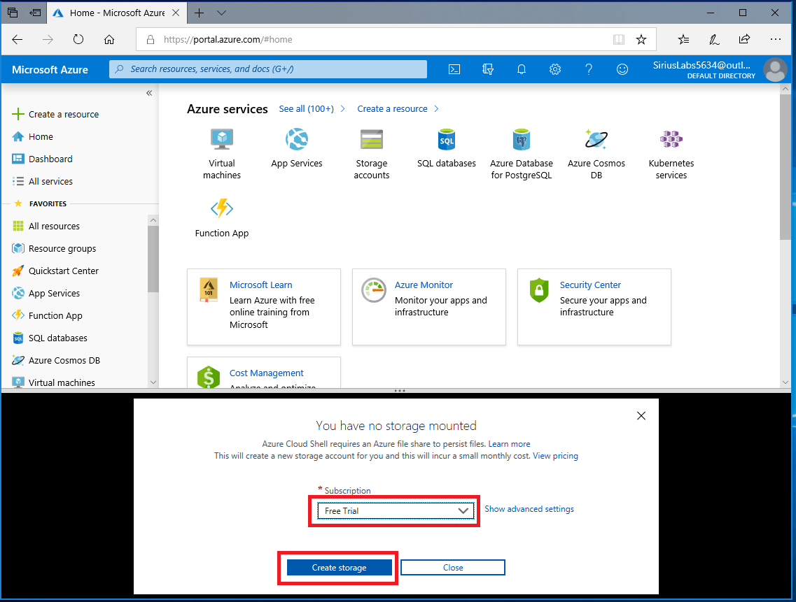
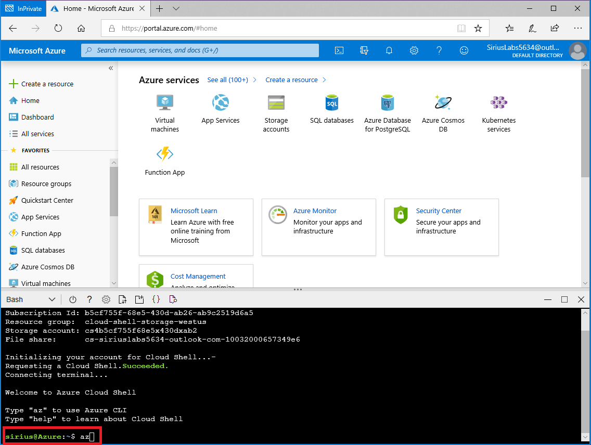

# Exercise - Write code to implement a web application

* 10 minutes

In this unit, you will use developer tools to create the C Sharp code for a starter web application.

## Login to the Azure Portal and Open Azure Cloud Shell in-line

1. Open the [Azure portal](https://portal.azure.com) in a browser.

2. Sign into Azure using the Microsoft account email address and password you created for this session.

3. Click the **Cloud Shell** icon in the toolbar to launch the in-line Cloud Shell window

4. If promoted, then click **Bash** in the window.

    

5. If prompted, select your subscription, and click **Create storage**.

    

6. To start the Azure CLI, enter the following command and press Enter.

        az

    

    You should see something like the following list of available commands:

    

## Create a new web project

The heart of the .NET CLI tools is the `dotnet` command line tool. Using this command, you will create a new ASP.NET Core web project.

1. In the Cloud Shell, create a new ASP.NET Core MVC application. Name it ***_TestNetWebAppXXXXXXX_***, where ***_XXXXXXX_*** is a word or number you add to give the web app a unique name.

    dotnet new mvc --name TestNetWebAppXXXXXXX

2. The command will create a new folder named ***_TestNetWebAppXXXXXXX_*** to hold your project. `cd` there, then build and run the application to verify it is complete.

    cd TestNetWebAppXXXXXXX

    dotnet run

    You should get something like:

        Hosting environment: Development
        Content root path: /home/your-user/TestNEtWebAppXXXXXXX
        Now listening on: https://localhost:5001
        Now listening on: http://localhost:5000
        Application started.

    The output describes the situation after starting your app: the application is running and listening at port 5000.

    If we were running the app on our own machine, we'd be able to open a browser to http://localhost:5000 and see our site. To make this accessible from outside of our own machine, we'll need to deploy the app to somewhere with a public endpoint. The App Service instance we created earlier is perfect for that.

3. Press **_Ctrl+C_** to shut down the running app.

Congratulations! You just created the C# code for a Web App, in the Azure Cloud Shell.
