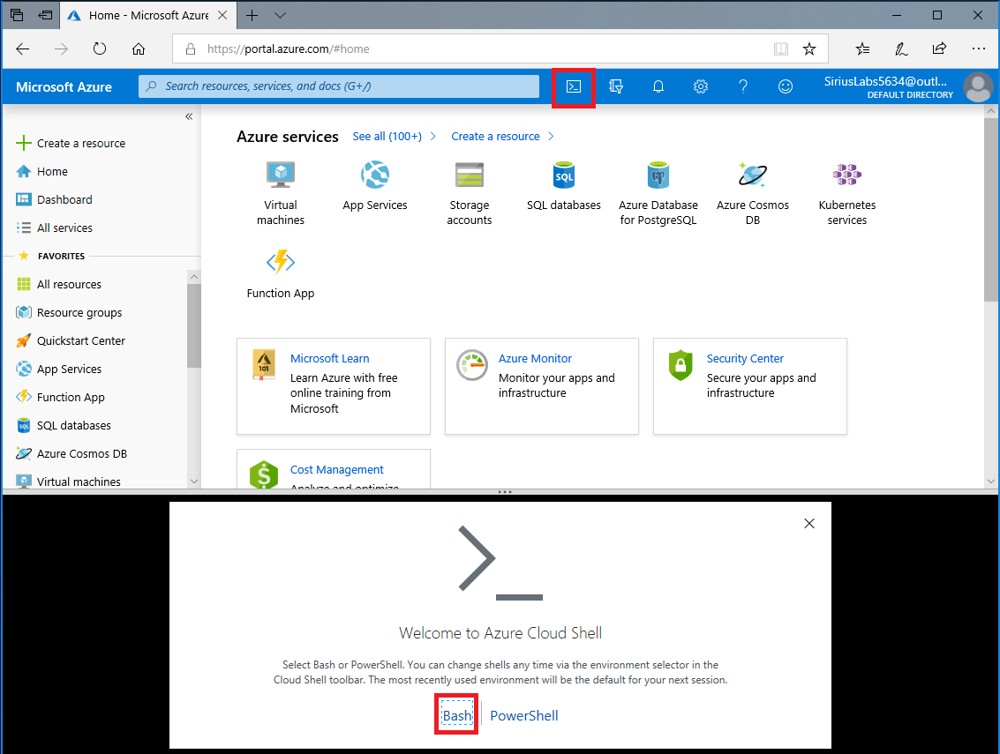

# Exercise - Deploy your code to App Service

* 20 minutes

In this unit, you'll deploy your C Sharp web application to App Service.

## Login to the Azure Portal and Open Azure Cloud Shell in-line

1. Open the [Azure portal](https://portal.azure.com) in a browser.

2. Sign into Azure using the Microsoft account email address and password you created for this session.

3. Click the **Cloud Shell** icon in the toolbar to launch the in-line Cloud Shell window

4. If promoted, then click **Bash** in the window.

    

5. If prompted, select your subscription, and click **Create storage**.

    

6. To start the Azure CLI, enter the following command and press Enter.

        az

    

    You should see something like the following list of available commands:

    

## Deploy with `az webapp up`

Let's deploy our application with `az webapp up`. This command will package up our application and send it to our App Service instance, where it will be built and deployed.

First, we need to gather some information about our web app resource. Run these commands to set shell variables that contain our app's name, resource group name, plan name, sku, and location. These use different `az` commands to request the information from Azure. `az webapp up` needs these values to target our existing web app.

    APPNAME=$(az webapp list --query [0].name --output tsv)
    APPRG=$(az webapp list --query [0].resourceGroup --output tsv)
    APPPLAN=$(az appservice plan list --query [0].name --output tsv)
    APPSKU=$(az appservice plan list --query [0].sku.name --output tsv)
    APPLOCATION=$(az appservice plan list --query [0].location --output tsv)

Now, run `az webapp up` with the appropriate values. Make sure you are in the `TestNetWebAppXXXXXXX` directory before running this command.

    az webapp up --name $APPNAME --resource-group $APPRG --plan $APPPLAN --sku $APPSKU --location "$APPLOCATION"

The deployment will take a couple minutes, during which time you'll see status output.

## Verify the deployment

Let's browse to our application to see it live. The last line of text output from `az webapp up`, before the JSON output, has a link to your app. Click it to navigate there in a new browser tab. The page will take a moment to load, as App Service is initializing your app for the first time.

Congratulations! You have successfully hosted your new ASP.NET Core application on App Service!
